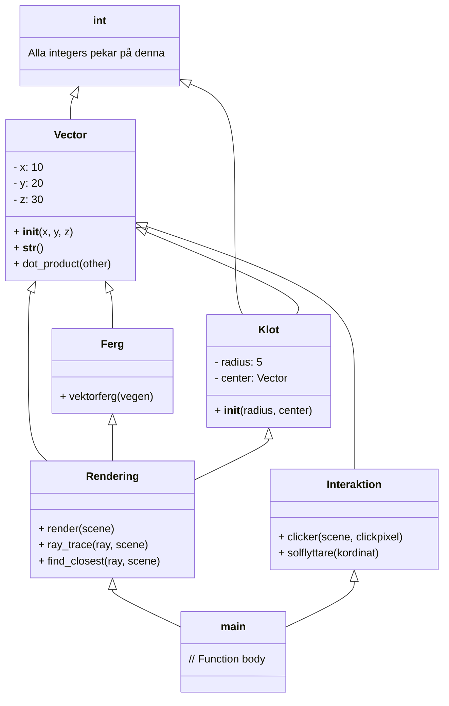

# Specifikation - Emilio Youssef
## Inledning
Detta program har som funktion att framställa en ett grafikfönster av ett klot belyst utav en ljuskälla, där dess skugga även ska framgå på en plan yta. Programmet ska köras i terminalen och låta användaren justera radien av klotet, ändra ljuskällans position och avsluta programmet med hjälp av en GUI. Programmet bygger huvudsakligen på en metod som kallas för Raytracing [@[cite](https://en.wikipedia.org/wiki/Ray_tracing_(graphics))] vilket används för att simluera ljusets interkation med objekt på ett realistiskt sätt.

### Utmaningar
Ett av de största utmaningarna är integrera Raytracing på ett effektivt sätt som våra egendefinierade vektorerna ska kunna användas på. Svårigheten ligger till stor del i att få kameran (användarens synfält) att fånga in ljusstrålarna från ljuskällan.

## Användarscenarier

### Cyberpunk 2077
CD Projects Red har nyligen fått i uppdrag att skapa Cyberpunkt 2077, vilket är ett spel byggt med realistisk grafik i en 3D-omgivning för att få spelaren att interagera med sin fysiska omgivning på likande sätt som man kan göra i verkligheten. I vekliga livet kan man se reflektioner av objekt genom reflektiva ytor som speglar och fönster. Därför behöver CD Projects Red implementera raytracing från ljuskällorna i den 3D-omgivningen som spelet är byggt på.

### Skulptur
Som slutprojekt i konsthögskolan Konstfack har Alva som slutprojekt att bygg en staty i Birgergarlsgatan som har formen av en stor metallisk sfär. Men enligt Stockholms riktlinjer kring offentlig konst får inte Alvas staty skymma husfönster mellan klockan 12:00 - 18:00. För att se ifall hennes staty kommer skymma dessa husfönster i närheten av statyn bygger hon upp husen med hennes staty i ett 3D-CAD program och implementerar raytracing för att se ifall skuggan av hennes staty kommer skymma husfönstrena under den förbjudna tidsramen genom att flytta runt ljuskällan (solen) till positioner som den befinner sig relativt til statyn från 12:00 - 18:00.

## Kodskelett

```
class Vector:
    """ Definierar vår egna vektor."""

    def __init__(self, x=0.0, y=0.0, z=0.0):
    """Vårt vektorrum."""

    def __str__(self):
        """Struktur för vektorn."""
        return "({}, {}, {})".format(self.x, self.y, self.z)

    def dot_product(self, other):
        """Returnerar inre produkten av vektorn som är inputvärdet 'other'."""
        return self.x * other.x + self.y * other.y + self.z * other.z

    #... Resterande operationer definieras längre ner ...


class Renderingen:
    """Gör 3D objekt till 2D objekt med hjälp av raytracing."""

    def render(self, scene):
    """Årdnar alla pixlar på planet i relation till användarens synflält. 'Scene' inehåller alla objekt som befinner sig på scene, information om synfältets position och kameran, samt ljuskällans position. """
        return pixels

    def ray_trace(self, ray, scene):
    """Detta är raytracefunktionen som returnerar "skuggfärgen" ifall reflektionen av ljusstrålen från kamerans synfält inte träffar ljuskällan. Ifall den träffar ljuskällan returneras istället den färgnyansen korresponderande till dess avstånd från ljuskällan i relation till den pixeln på skärmen som ligger absolut närmast ljuskällan."""
      pass

    def find_closest(self, ray, scene):
      """ Hittar pixeln på skärmen som är närmast ljuskällan. """
        pass

class ferg:
    def vektorfergen(vegen):
        pass
    """ Här måste vi generera den färg/nyans som behövs för en specifik pixel beroende på hur långt sammanlagda vektorn från synfältet till att den studsat från ytan/mark till solen/ljuskällan. Det behövs ta emot en vektor som skjuter ut från användarens synfält för att göra detta möjligt."""


class Klot:
    """ Vi tar emot en radie och en z0-position (x0,y0,z0) för klotets mittpunkt. """


class Interaktion:

    def clicker(self, scene, clickpixel):
        """ Clickpixel ska vara pixeln som man trycker på 2d-skärmen vilket ska translateras till en 3D-koordinat på bilden."""
        return position

    def solflyttare(self, kordinat):
    """ I main-fuctionen kommer en stor while-loop att fråga om input från clickerfunktionen och sedan i samma main-funcktion att använda 'position' (returdata från clicker-funktionen) för att flytta solen så att solen är precis rätvinkligt upp från den pixeln man har tryckt på i 3D-rummet (därav blir den punkten mest upplyst), vilket sker i solflyttarfunktionen som finns i classen. Denna process kommer behöva kalla funktioner från Vector klassen:"""
        pass


def main():

    """ Här definieras variabeln scene med information."""

    """Här kommer output hämtas från clicker-funktionen i en while-loop för att se - ifall pixeln man har tryckt på 2D-rummet (translaterat till 3D-rummet) inte finns på ytan av klotet kommer while-loopen att fortsätta köra tills man har tryckt på en pixel som finns på ytan av sfären. Ifall punkten finns på ytan kommer den däremot att köra solflyttarfunktionen som finns i klassen Interaktion."""

    """I den större while-loopen som täcker hela main-funktionen förutom de variablerna som vi behöver definiera för bilden som exempelvis kommer bilden att kontiuerligt plottas efter att den kört igenom alla andra funktioner. Notera att variabeln 'scene' kommer behöva uppdatteras efter varje loop av while."""

if "__name__" = "__main__":
      main()
```

## Minne

